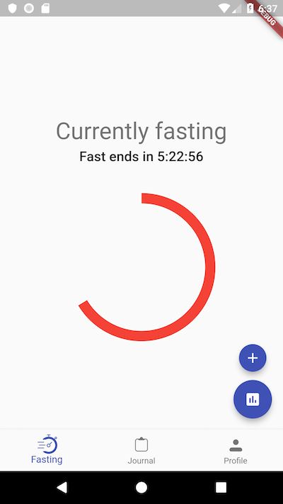

# FastTrack

FastTrack is an (intermittent fasting)[https://en.wikipedia.org/wiki/Intermittent_fasting] tracker.

It is my attempt and learning and experimenting with Flutter for mobile application development.

The app allows you to configure when your fasting period starts and ends, along with providing a
visual progress display. The app also allows supports weight tracking and will support meal tracking.

## Built with

* [Flutter](https://flutter.io)
* [Firebase](https://firebase.google.com/)
* [FlutterIcon](http://fluttericon.com/) for custom icon font